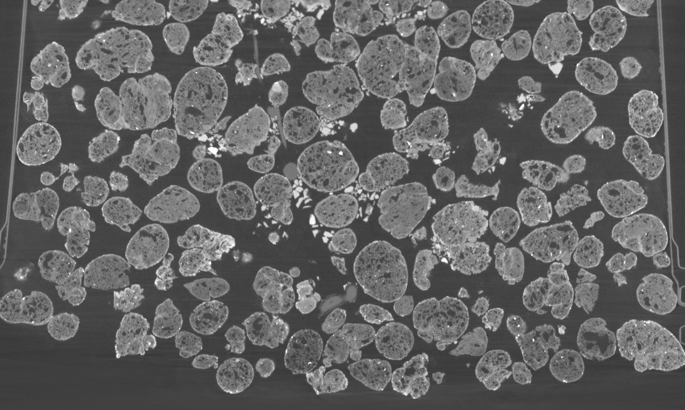

# tabb-level-set-segmentation

Comments/Bugs/Problems: amy.tabb@usda.gov

Method for segmentation using three-dimensional level set methods, optimized for roots in XRay CT.

~July, 2019.  Initial release.


# Underlying ideas; how and when to cite this work

This README file is to accompany code for robot-world, hand-eye calibration, produced by Amy Tabb as companion to a paper:
	Segmenting Root Systems in X-Ray Computed Tomography Images Using Level Sets

```
@inproceedings{tabb_segmenting_2018,
	title = {Segmenting {Root} {Systems} in {X}-{Ray} {Computed} {Tomography} {Images} {Using} {Level} {Sets}},
	doi = {10.1109/WACV.2018.00070},
	abstract = {The segmentation of plant roots from soil and other growing media in X-ray computed tomography images is needed to effectively study the root system architecture without excavation. However, segmentation is a challenging problem in this context because the root and non-root regions share similar features. In this paper, we describe a method based on level sets and specifically adapted for this segmentation problem. In particular, we deal with the issues of using a level sets approach on large image volumes for root segmentation, and track active regions of the front using an occupancy grid. This method allows for straightforward modifications to a narrow-band algorithm such that excessive forward and backward movements of the front can be avoided, distance map computations in a narrow band context can be done in linear time through modification of Meijster et al.'s distance transform algorithm, and regions of the image volume are iteratively used to estimate distributions for root versus non-root classes. Results are shown of three plant species of different maturity levels, grown in three different media. Our method compares favorably to a state-of-the-art method for root segmentation in X-ray CT image volumes.},
	booktitle = {2018 {IEEE} {Winter} {Conference} on {Applications} of {Computer} {Vision} ({WACV})},
	author = {Tabb, A. and Duncan, K. E. and Topp, C. N.},
	month = mar,
	year = {2018},
	keywords = {Shape, Image segmentation, Computed tomography, Level set, Media, Soil, X-ray imaging},
	pages = {586--595},
}
```

This paper is also available free to read (identical to the IEEE version) on [arXiv](https://arxiv.org/abs/1809.06398).

Dataset and/or code is available at Zenodo:

http://doi.org/10.5281/zenodo.3333709

If you use this code in project that results in a publication, please cite at a minimum the paper above; I prefer that you cite both sources.  Otherwise, there are no restrictions in your use of this code.  However, no guarantees are expressed or implied.

# Building

This README covers instructions for building the code and using the example datasets provided at Zenodo.

## Dependencies

OpenCV 4.0.1 (OpenCV 3.0 may work with changes of some enums - read below)

Eigen 3.3.4

OpenMP

[OpenCV](http://opencv.org/) As of this writing, the version installed from [github](https://github.com/opencv/opencv) is returning OpenCV 4.0.

To convert code written under OpenCV 3.0 to OpenCV 4.0, the biggest change revolved around imread flag enums such as `CV_IMREAD_GRAYSCALE`.  To get this code to compile under OpenCV 4.0, all I did was change such a flag to `cv:: IMREAD_GRAYSCALE`.  To go back to OpenCV 3.0, you would do the opposite.  Also, OpenCV 4.0 requires the compiler to be C++11 (or greater).

This code has been tested on Ubuntu 16.04 and Ubuntu 18.04.  You are welcome to convert it to Windows, but I have not.  While OpenCV is available from distribution repositories, my long experience with it is has always been to build from the source to get the best results.

**Is getting all of this to work on your system too much of a pain and you are interested in a Docker release?  Let me know!  The squeaky wheel gets the grease.  Email above.**


## Building 

Building:

Basic instructions for compilation and linking:

1.   This code has been written and tested on Ubuntu 16.04 and Ubuntu 18.04, using Eclipse CDT as the IDE, and is written in C/C++.

2.   This code is dependent on OpenCV-4.0.1 libraries, Eigen (3.3.4 has been tested, likely lower versions will work) and OpenMP library (libgomp). These libraries should be in the include path, or specified in your IDE.  Eigen is a header-only library.

3. Compiler flags: we use OpenMP for parallelization and a C++11 compiler. Note that Eclipse's indexer marks some items from C++11 as errors (but still compiles).

The compiler flags needed to use the gnu compiler, openmp, and the C++11 standard are: -fopenmp -std=gnu++11 .  In Eclipse, I add these under C/C++ Build->Settings->Cross G++ Compiler->Miscellaneous .  

though depending on the compiler used, you may need different [flags](https://www.dartmouth.edu/~rc/classes/intro_openmp/compile_run.html).
	
4. 	libraries needed for linking are:
	 gomp   [OpenMP],
	opencv_core [OpenCV],
	opencv_highgui,
	opencv_imgproc,
	opencv_imgcodecs.

5. **Note before going further -- if in Ubuntu, you need to `apt-get install build-essential` to get C++ compiler(s) that are OpenMP enabled.  If you are on a Mac, you will need something comparable to build-essential.**
	
6. Easy way to build in Ubuntu with [Eclipse CDT](https://www.eclipse.org/cdt/) with git support (Egit): 
- `git clone` into the directory of choice.  
- Create new Managed C++ project, for the directory, select the directory where the repository was cloned into.
- The compiler and linker flags for OpenCV 4.0 will be imported. Double check that these align with where you have installed OpenCV 4.0. Build and you're ready to run!

7. Easy way to build without Eclipse CDT:

Here my include directory are the system include directory, Eigen include directory `/usr/include/eigen3/`, and OpenCV4 include directory `/usr/local/include/opencv4`.

```
g++ src/*.cpp -o level_set_seg -fopenmp -std=gnu++11 -Wall -I/usr/local/include -I/usr/include/eigen3/ -I/usr/local/include/opencv4 -lgomp -lopencv_core -lopencv_imgproc -lopencv_imgcodecs
```

The executable `level_set_seg` is created.  If you used method 6., the location will be in `Debug`.


# Datasets, input, output, and run parameters

Datasets are posted at Zenodo, [http://doi.org/10.5281/zenodo.3333709](http://doi.org/10.5281/zenodo.3333709)

It is assumed that the dataset is in the form of a directory of 2D image slices.  Code to convert an existing dataset of 2D images to a different orientation is included, and will be discussed in section [Parameters -- for preprocessing](#parameters-for-preprocessing).

## Root segmentation

### Required Input Directories:

1. `images`
This directory has the 2D images slices.   The datasets included in this code release provide examples.  If you know that the object of interest is included in the center, not all of the images are required, but the images included *have* to be contiguous.

2. `masks`
This directory contains images with an initialization of the root regions.  First, I will mention the naming scheme.  
- The name of the image file must match the corresponding name of the file in `images`.
- The root regions should be marked in any primary color: red, green, or blue. Below, the left-hand image is an original image slice, and the right-hand image is an annotated image.  Not all root regions need to be marked in an image; squiggles are sufficient.  Important: do not mark non-root regions.

  


3. Optional directory `ylimit`
This directory has one image in it. This directory is used when there is space at the bottom of the image that the user wishes to remove from processing by the algorithm.  To do so, mark one of the images with any primary color with a line as shown below on the left-hand side.  In the results directory, the file `mask_outline.png` shows a binary image, where the white regions will be processed and black regions will not (right-hand side).   

 

 


### Running

To run the method, we discuss how to [run the method](#parameters-run-segmentation-with-an-example-dataset) with the provided examples from the paper.  

### Parameters, run segmentation with an example dataset

Parameter descriptions.  We reference the paper, so provide the link to the arXiv version [arXiv](https://arxiv.org/abs/1809.06398).  It is also assumed that we are dealing with 8-bit greyscale images.  To change to 12- or 16-bit images is possible, but will require rewrites throughout the code. 

1. input-directory: (string) set up according to [Required Input Directory](#required-input-directories) [Mandatory].
1. output-directory: (string) ideally empty directory where the results will be written.  Results computed with the method and parameters are also provided with the dataset [Mandatory].
1. lower-root-threshold: see section 4.1 of the paper, page 6. (Integer < 255 and >= 0).  This is the minimum greylevel for the root class  <span class="math inline"><em>Ω</em><sub>2</sub></span>.
1. upper-root-threshold: see section 4.1 of the paper, page 6. (Integer < 255 and >= 0).  This is the maximum greylevel for the root class  <span class="math inline"><em>Ω</em><sub>2</sub></span>.
1. background-threshold: see section 4.1 of the paper, page. 6. (Integer < 255 and >= 0). Minimum value for root and non-root materials (<span class="math inline"><em>Ω</em><sub>1</sub></span> and <span class="math inline"><em>Ω</em><sub>2</sub></span>).  Use of this value aids in removing known non-root voxels from the search region, such as air pockets.
1. nu (<span class="math inline"><em>ν</em></span>): (double), regularization parameter that favors smaller surfaces.  See text Equation 1 from the paper, and accompanying text.
1. grid-resolution: (unsigned integer), this is parameter <span class="math inline"><em>s</em> in the paper, and represents the size of the grid edges.
1. band-size: (unsigned integer), this is parameter <span class="math inline"><em>b</em> in the paper, and represents the size of the band used for the narrow band distance transform.  <span class="math inline"><em>s</em> ≥ <em>b</em></span>, see section 3.2, of page 4 of the paper for details.   grid-resolution ≥ band-size.
1. disregard-histogram-grid: (Boolean, 0 or 1). The default value is false.  Section 3.3, page 4 defines sets <span class="math inline"><em>Ω</em><sub>1</sub></span> and <span class="math inline"><em>Ω</em><sub>2</sub></span> through gradual exploration.  However, for one of our datasets, this approach did not work well.  To disregard the grid -- i.e. divide the whole space into <span class="math inline"><em>Ω</em><sub>1</sub></span> and <span class="math inline"><em>Ω</em><sub>2</sub></span> from the start as is usually done in level sets, specify that this variable be 1.  More details in Section 4.2, page 6.
1. t: ()
1. min-contour-size: (int). This is the parameter k on Section 3.4, page 5. When the active contour, <span class="math inline">𝒞<sub><em>a</em></sub></span>, <span class="math inline">|𝒞<sub><em>a</em></sub>|&lt; <em>k</em></span>, the program terminates.  There is a small error in the paper, where instead "<span class="math inline">𝒞<sub><em>a</em></sub> &lt; <em>k</em></span>" is listed.
1. max-threads: (int). Default is what is returned from omp_get_max_threads(). This code uses OpenMP, and my experience using an older simultaneous hyperthreaded processor is that using the maximum number of threads is not the best use of the machine.  To avoid this problem, set the number of threads using this argument.
1. write-on-image: (Boolean, 0 or 1), when this parameter is 1, the segmented root regions are written blue over on the original image regions, in a directory `color_final` within the output directory. Default is false. 
1. write-initial: (Boolean, 0 or 1), when this parameter is 1, the initialization mask(s) is written in the directory of images format, similarly as the final results, in directory `0`.  This allows you to load the masks as a 3D representation and compare to the results.   

If write-on-image is selected, the final result is indicated, in blue, over the original image (in directory `color_final`, and the initialization is also indicated in the same way in directory `color0`.  There are other variables within the LevelSets.cpp file, LevelSetMainFunction() that you can alter to output results while in the process of running the algorithm, but as writing results to file affects the methods runtime -- and the argument list is already getting quite long --  we mention the highlights as arguments here.  
  
#### Example one: soybean

Using input `SoybeanDataset` from the dataset release http://doi.org/10.5281/zenodo.3333709, the result is `SoybeanResultJul11` (also provided as part of the dataset).

Select the segmentation mode using the --segmentation flag, and I have options such as those below:

````bash
--segmentation \
--input=/home/username/Xray/Testsets/SoybeanDataset/ \
--output=/home/username/Xray/Results/SoybeanJul11/ \
--lowerthresh=65 \
--upperthresh=145 \
--background=0 \
--nu=1 \
--grid-resolution=10 \
--band-size=10 \
--disregard-histogram-grid=0 \
--t=1 \
--min-contour-size=100 \
--max-threads=24 \
--write-on-image=1 \
--write-initial=1
````

#### Example two: cassava

Using input `CassavaDataset` from the dataset release http://doi.org/10.5281/zenodo.3333709, the result is `CassavaResultJul12` (also provided as part of the dataset).

Select the segmentation mode using the --segmentation flag, and I have options such as those below:
 
````bash
--segmentation \
--input=/home/atabb/DemoData/Xray/Testsets/CassavaDataset/ \
--output=/home/atabb/DemoData/Xray/Results/CassavaJul12/ \
--lowerthresh=100 \
--upperthresh=200 \
--background=0 \
--nu=1 \
--grid-resolution=10 \
--band-size=10 \
--disregard-histogram-grid=1 \
--t=1 \
--min-contour-size=100 \
--max-threads=24 \
--write-on-image=1 \
--write-initial=1
````
  
### Output format

As alluded to above, the output format will vary depending on what flags are set.  The results are written as individual images black and white images, where the white regions indicate root regions.  The folder `final` holds the segmentation result, and `CClargest` holds the largest connected component.  `CC` holds the connected components that are connected to the initialization regions indicated by the user.

### Converting output to 3D models

Then, to generate a three-dimensional representation of the root structure, there are many options but I used [ImageJ/Fiji](https://imagej.net/Downloads) to load the images as an image sequence.  **Note that the software I used in 2017 when I was preparing this paper has all been replaced, and the current version I could find does not perform the same way.  The image output of my code is the same, but the 3D models produced by this converter within ImageJ is not.  I am planning to write a method to convert the image output to a surface that is appropriate to these types of surfaces, but in the interest of getting this code out sooner, I will do that in another release and link here.  The models produced with ImageJ in 2017 are included in the result directories in a `2017_results` directory.** 

In ImageJ, `import -> image sequence` and then select the `final` image directory.  From there, I was using ImageJ/Fiji 1, and the corresponding BoneJ [http://bonej.org/](http://bonej.org/).  Note that this software has all moved into version 2 now, with a different set of instructions.  I am providing instructions for the older version (1), where Java 6 is required. 

Then, apply the [BoneJ plugin](https://imagej.net/BoneJ) to create a surface representation.  In BoneJ the function is called *Isosurface* (`plugins->BoneJ->Isosurface`).  You will be presented with some options, I tend to select the re-sampling variable to 3 for thicker objects, and then leave the threshold at 128.  The images are binary, so anything greater than 1 will capture the segmented regions.  Then click "save as STL".  ImageJ/Fiji will create the surface, and display it in the 3D viewer, and you can also select the output file.  

I then take a look at the 3D object using [Meshlab](www.meshlab.net/).  There are *many* options on how one can do this -- just presenting my own here. 

 


## Preprocessing 

It is often convenient to transform the image slices from one orientation into another, for the manual annotation.  For instance, the image slices may be presented parallel to the ground, but roots generally grow vertically, so the area of roots captured on individual images is small.  To deal with this problem, we include code to quickly transform the image slices to row-oriented format.

The image on the left shows the original image layout, where the slices were parallel to the ground, and the image on the right shows the a row-oriented image resulting from this preprocessing option. 


### Parameters -- for preprocessing

Select the preprocessing by using the `--preprocessing` flag, and then arguments are:

1. input-directory: (string), a directory of images [mandatory].
1. output-directory: (string) ideally empty directory where the results will be written [mandatory].
1. max-threads: (int). Default is what is returned from omp_get_max_threads(). This code uses OpenMP, and my experience using an older simultaneous hyperthreaded processor is that using the maximum number of threads is not the best use of the machine.  To avoid this problem, set the number of threads using this argument.
  
For instance, one may run the program as follows:

````bash
./function-name --preprocessing --input /home/username/Data/Xray/CassavaInput/ --output /home/username/Data/Xray/CassavaOutput/ --max-threads 16
````

You could use either of the datasets mentioned previously as input, or `CassavaSlices` from the dataset release http://doi.org/10.5281/zenodo.3333709 and use the `images` directory.
